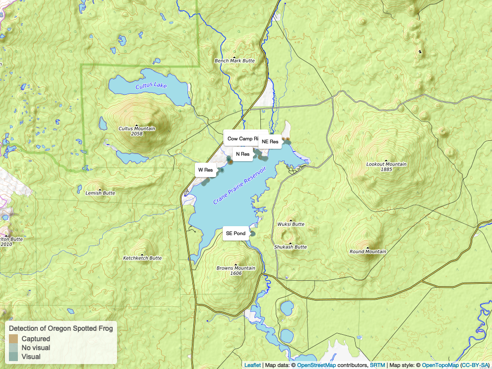
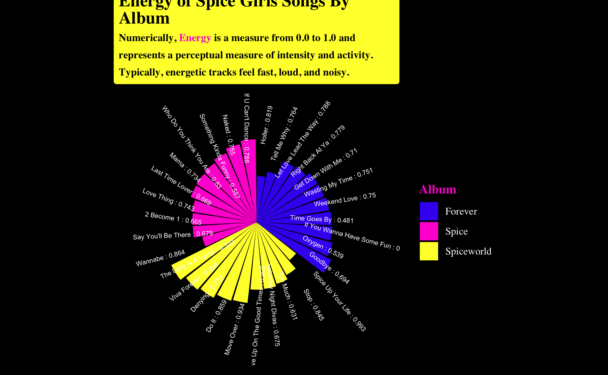

# Tidy Tuesday Repository
## Scout Leonard

This repository contains my attempts at Tidy Tuesday data visualizations in R using data from R for Data Science's [Tidy Tuesday Github repository ](https://github.com/rfordatascience/tidytuesday). 

I do not participate in Tidy Tuesday every week, but when I do, I create a folder in this repo names for the date the dataset was released containing all the documents related to my participation in that week's Tidy Tuesday. These are organized into folders by year in the repository. 

Below are some of my visualizations with their source code linked for reference.

# Oregon Spotted Frogs 

[Source code here.](https://github.com/scoutcleonard/tidytuesday/blob/master/docs/2022/2022-08-02/2022-08-02.qmd)

#Baby Names

[Source code here.](https://github.com/scoutcleonard/tidytuesday/blob/master/docs/2022/2022-03-22/2022-03-22.Rmd)

# Spice Girls Music

[Source code here.](https://github.com/scoutcleonard/tidytuesday/blob/master/docs/2021/2021-12-14/2021-12-14.Rmd)

# Spiders of the World

[Source code here.](https://github.com/scoutcleonard/tidytuesday/blob/master/2021/2021-12-07/2021-12-07.Rmd)

# Avatar the Last Airbender

  
[Source code here.](https://github.com/scoutcleonard/tidytuesday/tree/master/2020/2020-08-11) This was inspired by the [R Ladies Santa Barbara presentation "aRt + ggplot"](https://www.youtube.com/watch?v=h0i6KAahLY8&t=2384s) from [Ijeamaka Anyene](https://twitter.com/ijeamaka_a). I was really excited to learn to do radial visualizations! And to use ATLA data :) 

# Birds of Australia

My first ever Tidy Tuesday! 

[Source code here.](https://github.com/scoutcleonard/tidytuesday/tree/master/2021/2021-08-31) My first Tidy Tuesday visualization. I won a cupcake for this one in a challenge with my classmates! 

